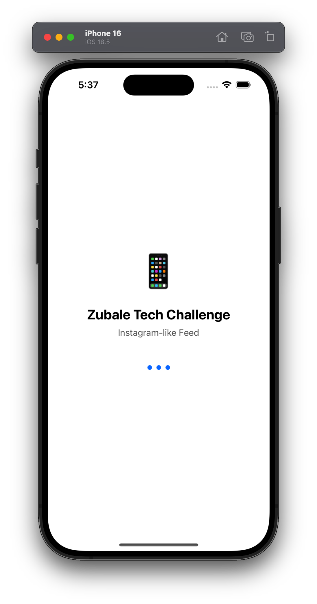
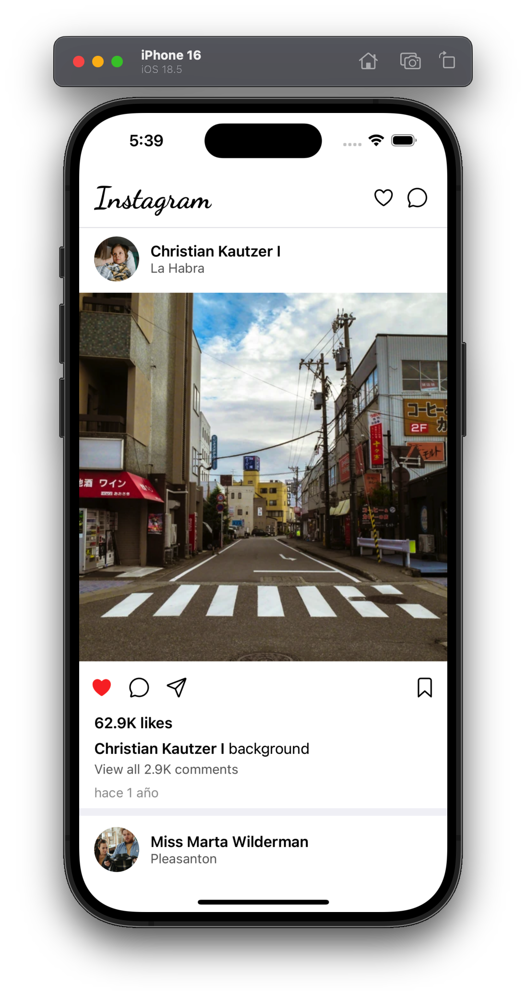

# Zubale Tech Challenge - Instagram Feed Clone

A React Native/Expo application that replicates Instagram's feed functionality using modern development practices and a robust architecture.

## 🚀 Features

- **Instagram-like Feed**: Displays posts with user avatars, images, captions, and engagement metrics
- **Custom Splash Screen**: Animated splash screen with custom typography
- **Robust Image Handling**: Fallback mechanisms for failed image loads using `expo-image`
- **Atomic Design Architecture**: Organized component structure (atoms, molecules, organisms, templates)
- **TypeScript**: Full type safety throughout the application
- **Custom Fonts**: Dancing Script font for branding (similar to Instagram's logo)
- **Error Handling**: Comprehensive error handling for API calls and image loading

## 🏗️ Architecture

### Atomic Design Structure

```bash
src/components/
├── atoms/          # Basic building blocks (Button, Text, Image, Icon)
├── molecules/      # Simple combinations (PostHeader, PostFooter, PostActions)
├── organisms/      # Complex components (PostCard, FeedList)
└── templates/      # Page layouts (FeedTemplate, SplashScreen)
```

### Key Components

- **Image Component**: Handles image loading with fallback URLs and error recovery
- **PostCard**: Displays individual posts with all Instagram-like elements
- **FeedList**: Manages the list of posts with proper scrolling
- **SplashScreen**: Custom animated loading screen with branding

## 🔧 Technical Solutions

### Image Loading Issues Resolution

The project initially faced challenges with image loading from the API endpoints. The original API URLs were not returning valid images, so I implemented a comprehensive solution:

- **Network Permissions**: Added `INTERNET` and `ACCESS_NETWORK_STATE` permissions to `app.json` for Android
- **Migration to expo-image**: Replaced React Native's `Image` with `expo-image` for better network handling and built-in caching
- **Fallback URLs**: Implemented robust fallback mechanisms using reliable image services:
  - **User Avatars**: `https://static.photos/people/640x360/` with random IDs
  - **Post Images**: `https://static.photos/1024x576/` with random IDs
  - **Test Images**: Used `https://picsum.photos/` and `https://via.placeholder.com/` for development
- **Error Recovery**: Added retry logic and timeout management to handle network failures gracefully

### Custom Font Integration

- Used `@expo-google-fonts/dancing-script` for reliable font loading
- Applied custom typography to app branding elements
- Eliminated local TTF files in favor of Google Fonts library

## 📦 Dependencies

### Core

- `expo`: Latest version with file-based routing
- `react-native`: Core framework
- `typescript`: Type safety

### UI & Styling

- `@expo/vector-icons`: Icon library (Ionicons)
- `@expo-google-fonts/dancing-script`: Custom typography
- `expo-image`: Enhanced image handling
- `expo-splash-screen`: Splash screen management

### Development Tools

- `eslint`: Code linting
- `prettier`: Code formatting
- `husky`: Git hooks
- `commitlint`: Commit message validation

## 🚀 Getting Started

### Prerequisites

- Node.js (v16 or higher)
- npm or yarn
- Expo CLI: `npm install -g @expo/cli`

### Installation

1. **Clone the repository**

   ```bash
   git clone <repository-url>
   cd zubale-tech-challenge
   ```

2. **Install dependencies**

   ```bash
   npm install
   ```

3. **Start the development server**

   ```bash
   npx expo start
   ```

### Running the App

After starting the development server, you can:

- **iOS Simulator**: Press `i` in the terminal or scan the QR code with Expo Go
- **Android Emulator**: Press `a` in the terminal
- **Physical Device**: Scan the QR code with Expo Go app
- **Web**: Press `w` in the terminal

## 🏃‍♂️ Development Workflow

### Code Quality

The project uses several tools to maintain code quality:

- **ESLint**: Code linting with TypeScript support
- **Prettier**: Automatic code formatting
- **Husky**: Pre-commit hooks for quality checks
- **Commitlint**: Enforces conventional commit messages

### Project Structure

```bash
├── app/                    # Expo Router pages
├── src/
│   ├── components/         # Atomic Design components
│   ├── context/           # React Context providers
│   ├── pages/             # Page components
│   ├── services/          # API services
│   ├── types/             # TypeScript type definitions
│   └── utils/             # Utility functions
├── assets/                # Static assets
└── constants/             # App constants
```

## 🎯 Challenge Requirements Met

✅ **Feed Implementation**: Instagram-like feed with posts, images, and user information
✅ **Image Handling**: Robust image loading with fallback mechanisms
✅ **Component Architecture**: Atomic Design structure for scalability
✅ **TypeScript**: Full type safety implementation
✅ **Error Handling**: Comprehensive error management
✅ **Custom UI**: Splash screen and custom typography
✅ **Code Quality**: ESLint, Prettier, and Git hooks
✅ **Documentation**: Complete setup and usage instructions

## 🔍 Key Technical Decisions

1. **expo-image over react-native Image**: Better network handling and built-in caching
2. **Atomic Design**: Scalable component architecture for maintainability
3. **Google Fonts**: Reliable font loading without local file management
4. **Custom Splash Screen**: Enhanced user experience with branding
5. **Fallback URLs**: Ensures app functionality even with API image failures

## 📱 Screenshots





The app features:

- Custom splash screen with animated branding
- Instagram-style feed with user avatars and post images
- Robust error handling for network issues
- Smooth scrolling and modern UI elements

Built with ❤️ using React Native, Expo, and modern development practices.
